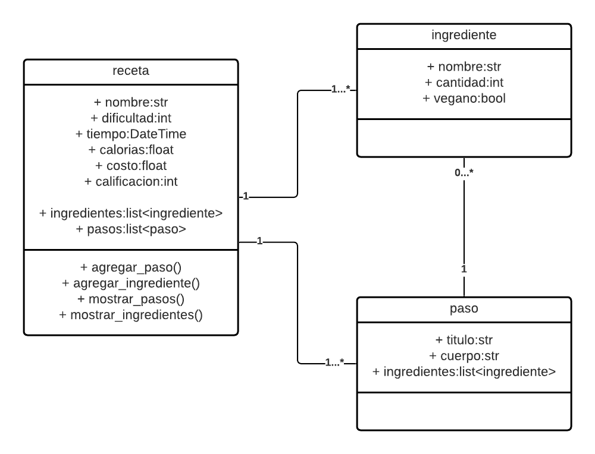

# CRUD Recetas
---
## Overview: Problema a resolver
Tener una plataforma web en la que usuarios puedan ver, añadir, editar y elminar recetas.

### Alcance(Scope)
Como es web puede llegar a un público amante de la cocina extenso con solo su navegador.

#### Casos de uso
Para un sólo usuario
- Ver recetas
- Ver receta
- Añadir receta
- Ver ingredientes de la receta
- Crear receta
- Editar receta
- Ver pasos de la receta
- Eliminar receta
- 

#### Out of Scope (casos de uso No Soportados)
- El usuario no puede checkear los ingredientes
- El usuario no puede guardar recetas

---
## Arquitectura

### Diagramas

### Modelo de datos
Poner diseño de entidades, Jsons, tablas, diagramas entidad relación, etc..

---
## Limitaciones
Lista de limitaciones conocidas. Puede ser en formato de lista.
Ej.
* Llamadas del API tienen latencia X
* No se soporta mas de X llamadas por segundo
---
## Costo
Descripción/Análisis de costos
Ejemplo:
"Considerando N usuarios diarios, M llamadas a X servicio/baseDatos/etc"
* 1000 llamadas diarias a serverless functions. $XX.XX
* 1000 read/write units diarias a X Database on-demand. $XX.XX
Total: $xx.xx (al mes/dia/año)